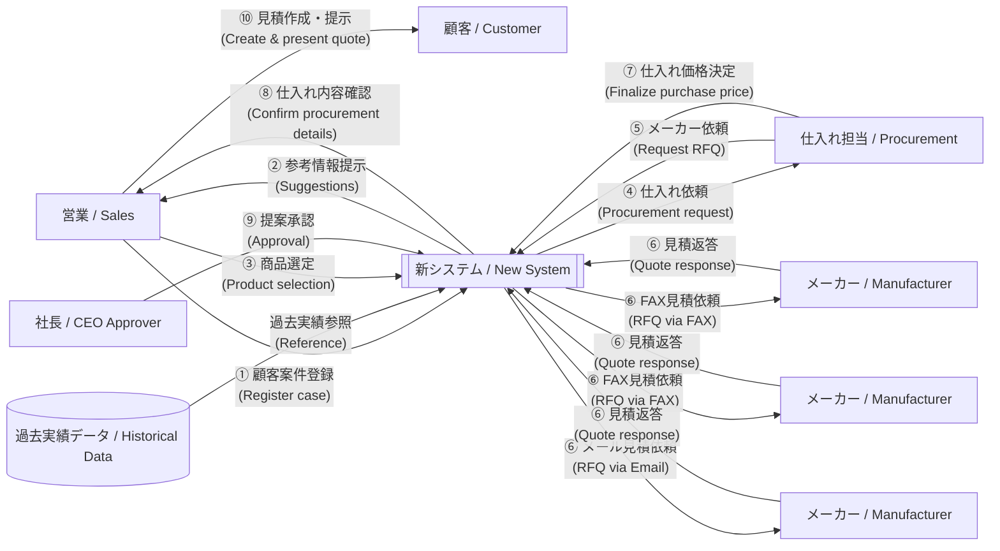
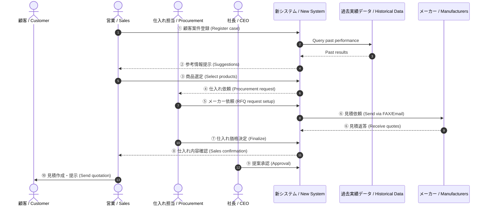

# Flow Visualization (Markdown)

## Option A — Mermaid Flowchart (recommended)
> You can paste this into any Mermaid-enabled viewer (GitHub, many docs tools) to visualize.



---

## Option B — Mermaid Sequence Diagram (message-level view)


---

## Option C — Simple ASCII (no Mermaid support needed)
```text
顧客(Customer)  ←────────────── ⑩ 見積作成・提示 ──────────────  営業(Sales)
                                   ▲
                                   │⑧ 仕入れ内容確認
過去実績データ(Historical) ──→ 新システム(New System) ──→ 仕入れ担当(Procurement)
                                   │④ 仕入れ依頼               │⑦ 仕入れ価格決定
                                   │⑤ メーカー依頼             ▼
                                   ├─⑥ FAX/Email RFQ ─────────→ メーカー(Manufacturer) x N
                                   └←──────── ⑥ 見積返答 ──────┘
                                   ▲
                                   │⑨ 提案承認
                                 社長(CEO)
```
